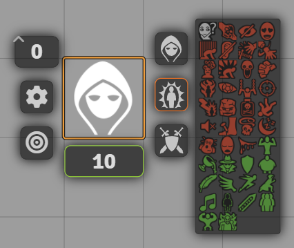
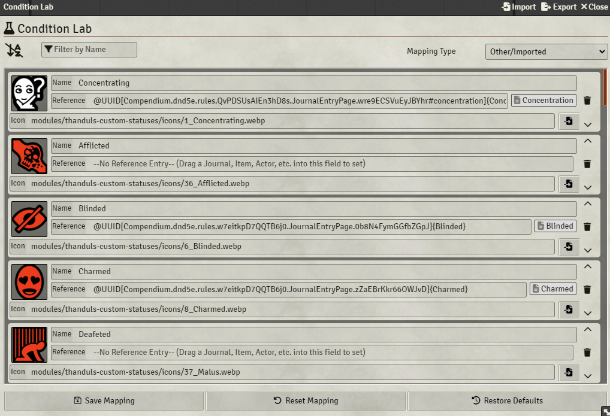

# Thandul's Custom Token Statuses

Stripped down fork of [Combat Utility Belt](https://github.com/death-save/combat-utility-belt) module that's no longer supported.
Adds just the Condition Lab that allow to replace system default token status icons.

